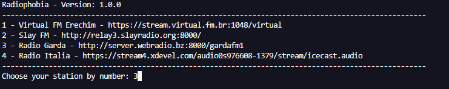
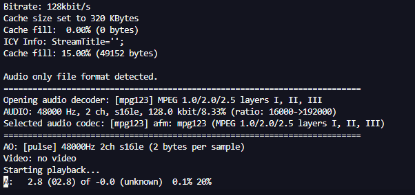

# RADIOPHOBIA 

Radiophobia is a simple script that allows you to listen radio stations in your terminal. It uses MPlayer Linux client to reproduce the streamings urls.

## Requirements

 - Python 3.5+
    - flake8
    - mccabe
    - pyflakes
 - Mplayer client

## Install and Run

1. Install the requirements:

    ```
    python -m pip install -f requirements.txt
    ```

2. Run with <code>python</code> command:

    ```
    python radiophobia.py
    ```

3. Choose your favorite station:

    

4. The radio will start to play and you will see the metadata of the radio.

    

5. After that you can use <code>mplayer</code> commands to manage the radio in the terminal. For example, you can press <code>p</code> to **pause** the streaming reproduction and press <code>p</code> again to **play**. You can find more mplayer commands in its [official website](http://www.mplayerhq.hu/DOCS/man/en/mplayer.1.html).

## CONTRIBUTING

You're welcome to contribute with this project.

Please, read the [CONTRIBUTING](./CONTRIBUTING) document.

## LICENSE

[MIT](./LICENSE)